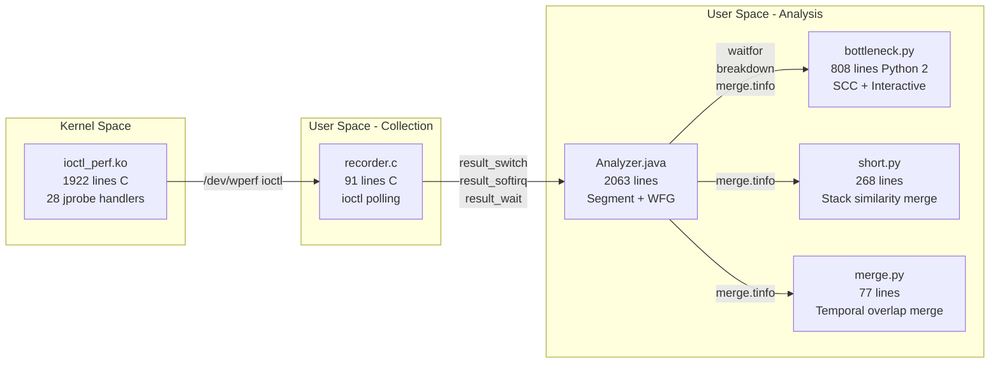
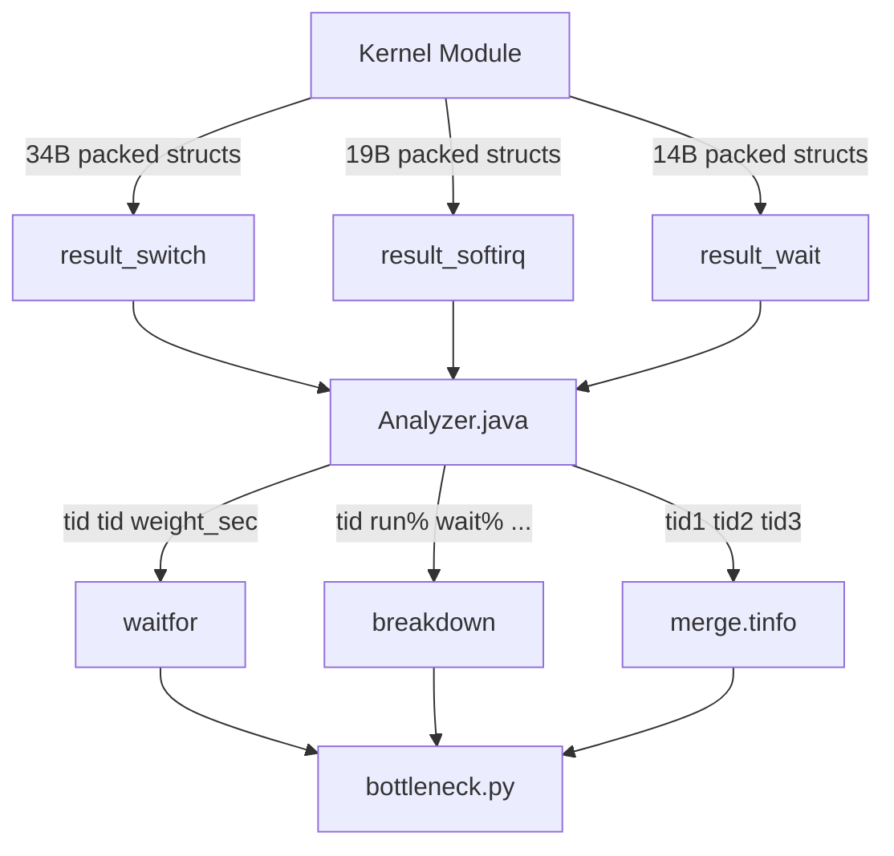
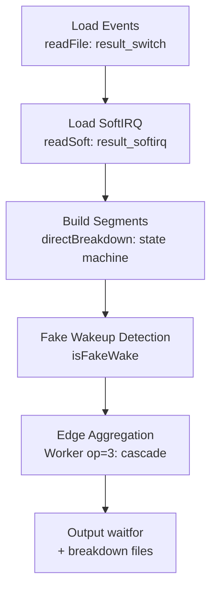

# Gate 0 — wPerf-origin Codebase Forensic Analysis

- **Issue:** #54
- **Date:** 2026-03-22
- **Scope:** Architecture mapping, technology gap, algorithm extraction, bug cross-reference, limitations

## 1. Git History Assessment

wPerf-origin has **7 commits**: one bulk "First commit" by `t1mch0w` (6,073 lines, 32 files), followed by 6 README-only edits. No branches, no tags, no meaningful commit messages. **Git history provides zero insight into development evolution.** All analysis below is from code forensics.

## 2. Architecture Overview



### Component Responsibilities

| Component | Lines | Language | Role |
|-----------|-------|---------|------|
| `ioctl_perf.c` | 1922 | C (kernel module) | JProbe-based event capture via `/dev/wperf` char device |
| `recorder.c` | 91 | C (userspace) | Polls kernel module every 1s, writes binary event files |
| `Analyzer.java` | 2063 | Java | State machine → segment construction → WFG edge aggregation |
| `bottleneck.py` | 808 | Python 2 | SCC decomposition + interactive edge-removal visualization |
| `short.py` | 268 | Python 2 | Thread grouping by stack similarity (Jaccard distance) |
| `merge.py` | 77 | Python 2 | Thread grouping by temporal overlap (connected components) |

### Data Flow: 9 Intermediate Files



## 3. Kernel Module — JProbe Handlers and eBPF Mapping

### 3.1 Active JProbe Handlers → eBPF Equivalents

| JProbe Handler | Kernel Function | Data Captured | eBPF Equivalent | Gap? |
|---|---|---|---|---|
| `j___switch_to` | `__switch_to` | prev/next pid, states, TSC, CPU, IRQ context | `tp_btf/sched_switch` | None |
| `j_try_to_wake_up` | `try_to_wake_up` | waker/target pid, states, IRQ context | `tp_btf/sched_wakeup` | None |
| `j_tasklet_hi_action` through `j_rcu_process_callbacks` | 10 softirq handlers | Softirq type marker (-1 to -10) per CPU | `tp/irq/softirq_entry` (single tracepoint covers all vectors) | None — simpler in eBPF |
| `j___do_softirq` | `__do_softirq` | Entry/exit timing for softirq duration | `tp/irq/softirq_entry` + `softirq_exit` | None |
| `j_wake_up_new_task` | `wake_up_new_task` | Creator/new-task pid | `tp_btf/sched_process_fork` | None |
| `j_do_exit` | `do_exit` | Exiting pid | `tp_btf/sched_process_exit` | None |
| `j_part_round_stats` | `part_round_stats` | Per-device disk work time | `tp/block/block_rq_issue` + `block_rq_complete` | Partial — different granularity |
| `j_tcp_sendmsg` / `j_udp_sendmsg` | TCP/UDP send | Per-PID byte count | `tp/tcp/tcp_sendmsg` | None |
| `j_tcp_sendpage` / `j_udp_sendpage` | Page-based send | Per-PID byte count | kprobe only | No tracepoint |

### 3.2 Commented/Disabled Handlers (Not Needed for wPerf v1)

`j_futex_wait_queue_me`, `j_do_IRQ`, `j_local_apic_timer_interrupt`, `j___lock_sock`, `j_aio_complete`, `j_add_interrupt_randomness` — all commented out. Futex is handled via `tp/syscalls/sys_enter_futex` in wPerf.

### 3.3 Key Insight: Softirq Context via IRQ Field

The original module stores the softirq type in the `irq` field of `fang_result`:

```c
// In j_try_to_wake_up:
fr->irq = softirq[core];  // -1 to -10 = softirq vector, 0 = no softirq
```

This is the exact mechanism described in ADR-009 and §3.3 — wakeups within softirq context are attributed to pseudo-threads. wPerf uses `softirq_entry`/`softirq_exit` tracepoints to track the same per-CPU state.

## 4. Data Structures — Packed Binary Formats

### 4.1 fang_result (Switch/Wakeup Events) — 34 bytes

```
Offset  Size  Field        Description
 0      2     type         0=switch, 1=wakeup, 2=fork, 3=exit
 2      8     ts           TSC timestamp (CPU cycles)
10      2     core         CPU core ID
12      4     pid1         Source (prev/waker/creator)
16      4     pid2         Dest (next/target/new_task)
20      2     irq          IRQ context (-10..-1=softirq, 0=none)
22      2     pid1state    Source task state
24      2     pid2state    Dest task state
26      8     perfts       Performance clock timestamp
```

**Comparison with wPerf BaseEvent (23B):** wPerf uses a common header + TLV payload. The original packs everything into a flat struct with dual timestamps (TSC + perfclock). wPerf drops TSC in favor of `bpf_ktime_get_ns()` only.

### 4.2 softirq_result — 19 bytes

```
Offset  Size  Field    Description
 0      1     type     Always 0 (softirq_exit)
 1      8     stime    Softirq start time
 9      8     etime    Softirq end time
17      2     core     CPU core ID
```

### 4.3 fang_uds (Futex/Lock Events) — 14 bytes

```
Offset  Size  Field    Description
 0      8     ts       TSC timestamp
 8      4     pid      Thread ID
12      2     type     1=futex_wait, 3=lock_sock, 4=futex_return
```

## 5. Analyzer.java — State Machine and WFG Construction

### 5.1 Pipeline Stages



### 5.2 State Machine (directBreakdown, line 558-702)

For each thread, processes events chronologically:

| Event | Current State | Action | New State |
|-------|-------------|--------|-----------|
| `sched_switch(pid1=tid)` | RUNNING | Create RUNNING segment | RUNNABLE or WAITING (by pid1state) |
| `sched_switch(pid2=tid)` | RUNNABLE | Create RUNNABLE segment | RUNNING |
| `sched_wakeup(pid2=tid)` | WAITING | Create WAITING segment with `waitFor=waker_pid` or `irq` | RUNNABLE |

**Inline softirq splitting:** When a RUNNING segment overlaps a softirq window on the same CPU, the segment is split into RUNNING → RUNNABLE(softirq) → RUNNING.

### 5.3 Pseudo-Thread IDs (Hardcoded)

| ID | Meaning | wPerf Equivalent |
|----|---------|-----------------|
| -4 | Network I/O | `softirq:NET_RX` pseudo-thread |
| -5 | Disk I/O | `block_device:<dev>` pseudo-thread |
| -15 | Hardware IRQ | Not modeled in wPerf v1 |
| -16 | Software IRQ | `softirq:<vec>` pseudo-thread |
| -99 | Spinlock/busy-wait | Not modeled in wPerf v1 |

### 5.4 Output: waitfor File

```
<from_tid> <to_tid> <weight_seconds>
1234 5678 0.123456
1234 -5 1.234567
```

Edge weights are raw observed wait times (seconds), NOT cascade-redistributed.

## 6. bottleneck.py — Critical Discovery

### 6.1 bottleneck.py Does NOT Implement Cascade Redistribution

**This is the most important finding of this analysis.**

bottleneck.py is an **interactive SCC visualization tool**, not a cascade algorithm implementation. It:
1. Reads the `waitfor` file (pre-aggregated raw edges from Analyzer.java)
2. Builds a NetworkX directed graph
3. Runs `nx.strongly_connected_components()` (Tarjan)
4. Provides an interactive REPL for edge removal and SCC inspection

The "cascade" mentioned in Analyzer.java Worker op=3 is the **edge aggregation** step (summing raw wait times into the waitfor file), not the recursive weight redistribution described in the OSDI'18 paper and ADR-007.

### 6.2 What bottleneck.py Actually Does

```python
# Core loop (lines 532-807):
while True:
    scc_result = scc_graph(G)      # Tarjan SCC
    print_scc(scc_result)           # Display table
    keypress = raw_input('Command:') # Interactive
    # Commands: drill into SCC, remove edges, show stacks, export CSV
```

### 6.3 SCC / Knot Detection (lines 362-392)

```python
# Knot = Sink SCC (no outgoing edges to other SCCs)
outgoing = sum(G.get_edge_data(m,n)['weight']
               for m in SCC_i, n in SCC_j if G.has_edge(m,n))
if outgoing == 0:
    memo = 'Bottleneck'  # This is a Knot
```

No business filtering (trivial sinks, kernel-only SCCs) — all SCCs are displayed.

### 6.4 Implication for Issue #8 (Cascade Understanding)

Since bottleneck.py has no cascade, Issue #8 must be reframed:
- **SCC/Knot validation**: Run bottleneck.py to verify SCC decomposition on a test graph — this IS testable
- **Cascade validation**: Must be done against the ADR-007 pseudocode and specs, not against bottleneck.py
- **Figure 4 validation**: The paper's cascade result (Network=80ms, Parser=20ms) cannot be reproduced by bottleneck.py alone — it would show raw edge weights, not redistributed weights

### 6.5 Python 2→3 Porting (for Issue #8)

| Change | Count | Effort |
|--------|-------|--------|
| `print X` → `print(X)` | ~50 | Mechanical |
| `raw_input()` → `input()` | 8 | Mechanical |
| `.has_key()` → `in` | ~5 | Mechanical |
| Bare `except:` → `except Exception:` | 1 | Mechanical |

**Total estimated effort:** 30 minutes.

## 7. Bug Cross-Reference (ADR-007)

Since cascade redistribution is NOT implemented in wPerf-origin, the 5 known bugs cannot be located in this codebase. They are design-level bugs identified during pseudocode review of the OSDI'18 algorithm:

| Bug | Nature | Where It Would Manifest | wPerf-origin Status |
|-----|--------|------------------------|-------------------|
| **BUG-1** | `visited_path` insert/remove inside loop body | Cascade DFS recursion | N/A — no cascade |
| **BUG-2** | `propagated_down` return value discarded | Cascade transfer penalty calculation | N/A — no cascade |
| **BUG-3** | Overlapping time windows cause double-counting | Sweep-line partition | Partially in Analyzer.java (inline softirq splitting) |
| **BUG-4** | Combined BUG-2 + BUG-3 | Weight conservation violation | N/A — no cascade |
| **NEW-BUG-1** | `child_self_blame` discarded → leaf nodes get zero | Cascade leaf attribution | N/A — no cascade |

**Key implication for Phase 0:** The Rust cascade implementation has NO reference implementation to test against. The 5-layer verification pyramid (ADR-007) is the only safety net. Differential testing (Issue #20) must use the ADR-007 pseudocode as the oracle, not wPerf-origin code.

## 8. Hardcoded Limits and Constraints

| Limit | Value | Impact on wPerf |
|-------|-------|----------------|
| Max target PIDs | 500 | wPerf uses cgroup filtering instead — no PID limit |
| Buffer size | 500 MB vmalloc | wPerf uses ringbuf (shared) or perfarray (per-CPU) — kernel-managed |
| Max CPUs | NR_CPUS (32-128) | wPerf uses per-CPU BPF maps — auto-scaled |
| Max disk devices | 20 | wPerf uses dynamic `block_device:<dev>` pseudo-threads |
| Network bandwidth | 125 MB/s hardcoded | wPerf does not model bandwidth — uses tracepoint-based attribution |
| Softirq tracking | Per-CPU single slot | Same in wPerf — `softirq_entry`/`softirq_exit` per-CPU map |
| Polling interval | 1 second | wPerf uses event-driven polling (`ring_buffer__poll`) |

## 9. Technology Gap Summary

### Clean eBPF Replacements (No Gap)

All core probes (sched_switch, sched_wakeup, sched_process_fork, sched_process_exit, softirq_entry/exit) have direct tracepoint equivalents. The original's 10 individual softirq jprobes collapse to a single `tp/irq/softirq_entry` with vector ID in the tracepoint data.

### Requires kprobe (Minor Gap)

`tcp_sendpage`, `udp_sendpage`, `add_interrupt_randomness` — no tracepoints. These are Phase 3+ concerns (network byte counting), not core WFG functionality.

### Architectural Improvements in wPerf

| Original | wPerf | Improvement |
|----------|-------|-------------|
| JProbes (removed in kernel 4.15) | tp_btf + raw_tp | Stable ABI, works on 4.17+ |
| 500MB vmalloc per buffer | ringbuf (shared) + perfarray fallback | Kernel-managed memory, backpressure |
| 34-byte flat packed struct | TLV with 23B BaseEvent + payload | Forward-compatible, extensible |
| Polling every 1 second | Event-driven `ring_buffer__poll` | Lower latency, no busy-wait |
| PID whitelist (500 max) | cgroupv2 filtering | Scalable, container-native |
| No crash recovery | `data_section_end_offset` in header | Recoverable on SIGKILL |

## 10. Discoveries Affecting Phase 0

1. **No cascade reference implementation exists.** The OSDI'18 paper describes the algorithm conceptually; wPerf-origin does not implement recursive weight redistribution. Phase 0's Rust implementation will be the **world's first production cascade implementation** with formal verification.

2. **Analyzer.java's "cascade" is edge aggregation, not redistribution.** Worker op=3 sums raw wait times into the `waitfor` file. The recursive DFS with proportional allocation and sweep-line partitioning described in ADR-007 is entirely new.

3. **Issue #8 must be reframed.** bottleneck.py can validate SCC/Knot detection but NOT cascade redistribution. Figure 4 validation requires manual computation or a purpose-built test harness against the ADR-007 pseudocode.

4. **The state machine in Analyzer.java is the closest reference for wPerf's Step 1.** The `directBreakdown()` function (lines 558-702) implements the same sched_switch/sched_wakeup correlation that wPerf's event correlation state machine must replicate.

5. **Pseudo-thread IDs use negative integers.** The convention (-4=NIC, -5=Disk, -16=SoftIRQ) maps directly to wPerf's named pseudo-thread design, but wPerf uses string-typed identifiers (`block_device:<dev>`) rather than hardcoded negative numbers.

## 11. Edge Aggregation vs Cascade Redistribution

The most important conceptual distinction for Phase 0:

**Edge aggregation (what Analyzer.java Worker op=3 does):**
```
A waits for B: [0, 50ms]
B waits for C: [20, 50ms] (overlapping)
→ Output: A→B = 50ms, B→C = 30ms
→ B appears to be the biggest bottleneck (50ms points at it)
```

**Cascade redistribution (what ADR-007 designs):**
```
Same input, but cascade traverses B's outgoing edges:
  B was waiting for C during [20, 50ms] — that's C's fault, not B's
→ Output: B attributed = 20ms, C attributed = 30ms
→ C is identified as the root cause
```

This is the fundamental reason wPerf finds **global bottlenecks** while standard off-CPU profilers only see **local longest waits**. The raw aggregation approach cannot distinguish between a thread that is genuinely slow (root cause) and one that is merely waiting for someone else (victim).

Since no production cascade implementation exists in wPerf-origin, the Rust implementation in Phase 0 will be the **world's first production cascade with formal verification** (7 invariants, 10K random graph proptest, mutation testing).

## 12. Additional Valuable Patterns from wPerf-origin

| Pattern | Location | Value for wPerf |
|---------|----------|----------------|
| `isFakeWake()` DPEvent state machine | Analyzer.java:808-895 | More sophisticated than our 50μs threshold — uses segment chain traversal to detect if woken thread immediately sleeps again. Worth studying for Phase 2a. |
| Network bandwidth model | short.py:4-5 (125 MB/s hardcoded) | Anti-pattern — wPerf correctly uses tracepoint-based attribution instead of hardcoded bandwidth constants. |
| Thread grouping by stack similarity | short.py (Jaccard distance) | Useful for Phase 3 thread pool collapse — when multiple threads in a pool have identical stacks, group them into a single logical node. |
| 32-worker parallelism for segment building | Analyzer.java Worker threads | Use Rayon in Phase 0/1 for parallel per-thread segment construction. |
| UDS (User-Defined Spinlock) annotation | Analyzer.java:29, 63-66 | Maps to deferred "User-space annotation (#11)" in §8.9 P2 items. |
| Per-CPU softirq tracking via irq field | ioctl_perf.c `fang_result.irq` | Exact mechanism ADR-009 describes — when `irq != 0` in sched_wakeup, the waker is a subsystem, not a thread. |
| `removeFakeWakeup()` commented out | Analyzer.java:510-556 | Suggests the original authors struggled with false wakeup detection — multiple implementations attempted and abandoned. |
| Dual timestamp (TSC + perfclock) | ioctl_perf.c `fang_result.ts` + `.perfts` | wPerf uses only `bpf_ktime_get_ns()` — simpler but loses cross-correlation with perf.data. Not needed for v1. |
